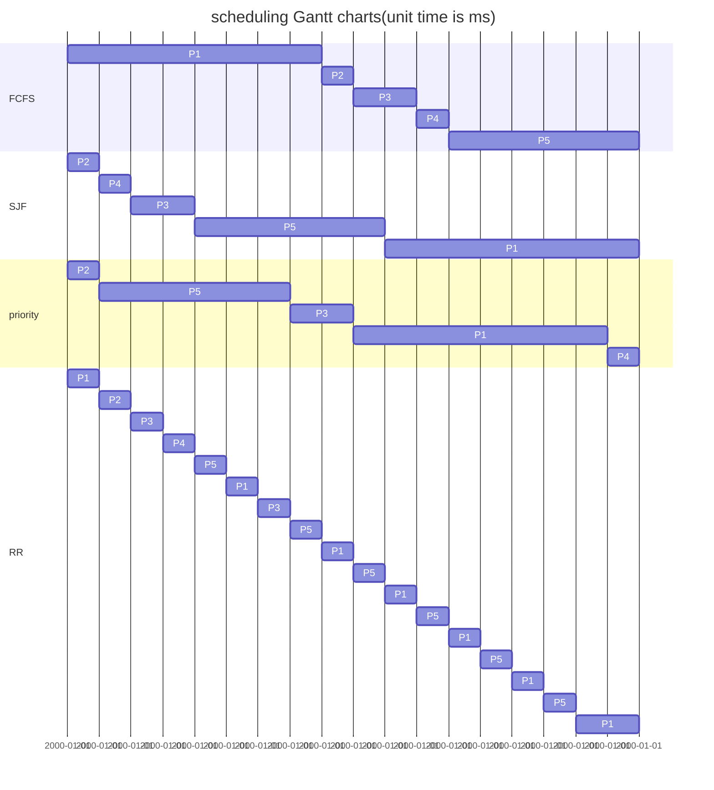

###### tags:OS2020Spring

This homework in [Hackmd Link](https://hackmd.io/@25077667/By8upiLcL)
---

1. Explain what memory-mapped I/O is and how it works.

    * What is MMI/O?
        A method for mapping an I/O port to a process's virtual memory space. If the file (devices will be treated as a file) uses memory-mapped I/O then you can write to the specific memory address (mapped by MMI/O) and the file will be updated with the new data.

        A picture:
        

    * How it works?
        In Linux, the kernel will use `ioremap()` to map bus memory into CPU space, then the user space process uses `mmap()` mapping the device memory space form kernel to the user process's memory space.
        And the `ioremap()` is defined in `mm/ioremap.c`:
        `void __iomem *ioremap(resource_size_t phys_addr, unsigned long size)`
        https://github.com/torvalds/linux/blob/master/arch/x86/mm/ioremap.c#L324

        For example: [Generic driver for memory-mapped GPIO controllers](https://elixir.bootlin.com/linux/latest/source/drivers/gpio/gpio-mmio.c)
    
2. Explain what DMA is and how it works.
    * What is DMA?
        A feature of computer systems that allows certain hardware subsystems to access main system memory, independent of the CPUs. Without DMA, when the CPU is using programmed input/output, it is typically fully occupied for the entire duration of the read or write operation, and is thus unavailable to perform other work. With DMA, the CPU first initiates the transfer, then it does other operations while the transfer is in progress, and it finally receives an interrupt from the DMA controller (DMAC) when the operation is done.

    * How it works?
        Take easy way to explain by pictures:
        
        
        
        [ref](https://archive.eettaiwan.com/www.eettaiwan.com/ART_8800468608_628626_TA_c61e2b68.HTM)

        Or, there is a big issue about DMA.
        The source code of DMA in Linux: [GitHub](https://github.com/torvalds/linux/blob/master/include/linux/dma-mapping.h)
        For example: 
        * Dealing with difficult hardware
        * Coherent DMA mappings, streaming DMA mappings
        * DMA pools(Allocation pools for DMAable (coherent) memory)
        * Single-page streaming mappings
        * Scatter/gather mappings
        * PCI double-address cycle mappings
        * DMA for ISA Devices
        * ==And so on==...
        [More reference](https://www.oreilly.com/library/view/linux-device-drivers/0596005903/ch15.html)
    
3. Consider the following set of processes, with the length of the CPU-burst time given in milliseconds:

| Process | Burst Time | Priority |
|:-------:|:----------:|:--------:|
|  $P_1$  |     8      |    4     |
|  $P_2$  |     1      |    1     |
|  $P_3$  |     2      |    3     |
|  $P_4$  |     1      |    5     |
|  $P_5$  |     6      |    2     |

The processes are assumed to have arrived in the order $P_1 , P_2 , P_3 , P_4 , P_5$, all at time $0$.
<!-- In this Answer's discription uses Mermaid -->
<!-- Strongly suggest using the HackMD to view this markdown -->
(a) Suppose there is no context switching

(b)
|       | FCFS | SJF | Priority | RR  |
|:-----:|:----:|:---:|:--------:|:---:|
| $P_1$ |  8   | 12  |    17    | 18  |
| $P_2$ |  9   |  1  |    1     |  2  |
| $P_3$ |  11  |  4  |    9     |  7  |
| $P_4$ |  12  |  2  |    18    |  4  |
| $P_5$ |  18  | 10  |    7     | 18  |

\(c\)
|       | FCFS | SJF | Priority | RR  |
|:-----:|:----:|:---:|:--------:|:---:|
| $P_1$ |  0   | 10  |    9     | 10  |
| $P_2$ |  8   |  0  |    0     |  1  |
| $P_3$ |  9   |  2  |    7     |  5  |
| $P_4$ |  11  |  1  |    17    |  3  |
| $P_5$ |  12  |  4  |    1     | 10  |

(d) 
Is "SJF", the total waiting time over all processes is 17.

4. A UNIX process has two parts—the user part and the kernel part. Is the kernel part like a subroutine and a coroutine? Why?

Well, I think it is like a subroutine procedure.
The process in the user space invokes the kernel space, the kernel space starts out in the same place.

And Linus Torvalds said: 
> The thing about an operating system is that you never ever supposed to seived. Because nobody really uses as operating system. People use program on their computer and the only mission in life of an operating system is to help those programs run. 
> So an operating system never does anything on its' own. It's only waiting for the programs to ask for certain resources, ask for certain files on the disk or ask for the programs to connect them to the outside world. And then the operating system comes steps in and tries to make it easy for people to wirte programs.
> 
[source](https://youtu.be/vWwvh3036Fw?t=149)
Time: 00:02:29 -> 00:03:09

So, the kernel space is a subroutine procedure to "HELP THOSE PROGRAMS RUN".
